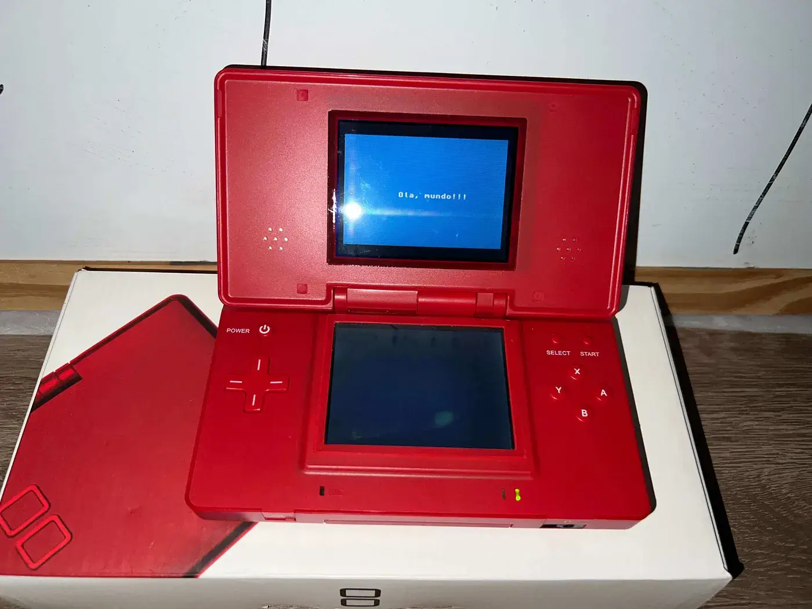

# Hi 👋, I'm Nisael!!!

Out of a habit I picked up in college, I added this paragraph here. It doesn’t feel right to me to have secondary headings without any text before them, so just pretend there’s some cool content here.

## A Transformative “Hello, World”!

Since I was a child, I have always been fascinated by electronics. I was very curious about understanding how everything worked, and that resulted in many digital watches being taken apart and never put back together.
Some time later, at a LAN house in a small town in the countryside, a friend of mine, who also happened to own the LAN house, told me something that stuck with me:

> “Dude, I got curious and started learning how to ‘program’ in HTML to create websites.”`

I had already searched the internet a few times using generic terms similar to “How to create a program.” For a layperson, the results were not very conclusive. But when I heard the term HTML for the first time, I finally had a direction.

Around 2012, I discovered Professor Gustavo Guanabara on YouTube. I downloaded all of his HTML videos because I didn’t have internet at home, and I started studying nonstop.

My first “Hello, World” in HTML was magical. I thought I was programming because, at the time, I didn’t know that HTML was not a programming language.

Since then, I have kept studying. I went through **Flash with ActionScript 2.0, PHP, Python, JavaScript, and TypeScript with Node.js**. I also used **Vue.js and Nuxt** for a long time, until I eventually found Svelte, which I really enjoy.

Today, I study **Flutter with Dart, Go, and C**, which brings us to a second “Hello, World.”

## A New Hello, World

I decided to face something I had been avoiding for a long time. I had always been very curious about low-level technologies, or even high-level technologies that could somehow bring me closer to the hardware.
This caused me quite a few headaches, but along with them came a lot of fun. The result has been a great deal of knowledge acquired, along with a few completed projects and many unfinished ones.

The first step I took was the **PS2-MC-Manager** project, inspired by the documentation of the **MyMC** project. Although it is not finished, I was able to **read the Super Block of the PS2 Memory Card** and **perform validations and unit tests, all using JavaScript in the browser**.

Through this project, I was able to learn about **bit shifting, work with typed arrays, and get a little bit into reverse engineering**.

The second project was an attempt to learn Assembly for Linux x86-64. I created a Docker image with a minimal Alpine Linux environment that runs on ARM architectures while using the amd64 environment, since my machine does not natively support the architecture of the Assembly platform I wanted to use.

This resulted in the **linux-amd64-on-apple-silicon** repository.

I also flirted with game development for the Game Boy Advance for a while, and I’m still dabbling in it from time to time. I’ve been studying whenever I have the time, and I managed to display a “Hello, World” written in C on the screen of a Nintendo DS — even if it was emulated, since I haven’t been able to get an EverDrive to run it natively yet:

Finally, I also created the **weather-report** project to practice C. I used **ESP-IDF, FreeRTOS, and LVGL 9** to display temperature and air humidity in real time.

This project allowed me to grow a lot because I faced several challenges.

### Weather-Report Challenges

- Learning about SPI communication with the display and integrating Espressif’s native library, esp_lcd_new_panel_st7789.

- Controlling the screen refresh rate using the functions available in LVGL and FreeRTOS.

- Learning about handling tolerable sensor errors so that the ESP32 would not restart unnecessarily.

## Developer passionate about web and low-level technologies!!!

- 🔭 I’m currently working on [Weather Report](https://github.com/NisaelMoreiraGomes/weather-report)

- 🌱 I’m currently learning **C, GoLang, Javascript, Typescript, Dart, Flutter and SvelteJs**

- 📝 I will soon write more on [https://baixonivel.blog/](https://baixonivel.blog/)

- 💬 Ask me about **ESP-IDF, FreeRTOS, Svelte and Astro.**

- ⚡ Fun fact **The Little Prince** is my favorite book, but I don't have a favorite song, movie, series, or cartoon.

## Blogs posts

<!-- BLOG-POST-LIST:START -->
- [Olá, mundo!!! Nascimento do Portal com Astro](https://baixonivel.blog/2026/09/ola-mundo/)
- [Me aventurando no desenvolvimento Homebrew de jogos para GameBoy Advance — Parte 2](https://medium.com/@NisaelMGomes/me-aventurando-no-desenvolvimento-homebrew-de-jogos-para-gameboy-advance-parte-2-04fdf46113e8?source=rss-d952d9b9928b------2)
- [Me aventurando no desenvolvimento Homebrew de jogos para GameBoy Advance — Parte 1](https://medium.com/@NisaelMGomes/me-aventurando-no-desenvolvimento-homebrew-de-jogos-para-gameboy-advance-parte-1-da2776f32c6f?source=rss-d952d9b9928b------2)
<!-- BLOG-POST-LIST:END -->

## Connect with me:

## Languages and Tools:

                               

